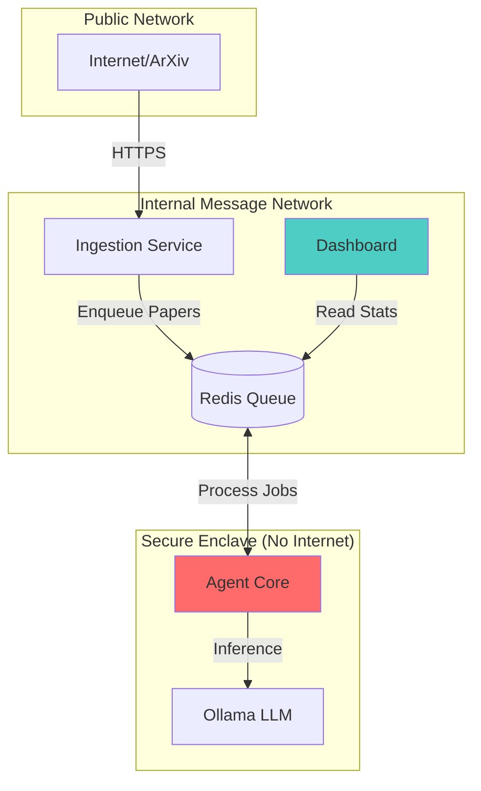

# AI Safety Radar - Project State

**Last Updated:** 2026-01-01 17:55 CET
**Current Phase:** Phase 4 - Intelligence Dashboard
**Completion:** 97% Complete
**Branch:** main
**Last Commit:** [Pending Update]

***

## 📋 Implementation Status

### ✅ Completed Features
- [x] Multi-agent workflow (Extractor → Analyzer → Curator)
- [x] Network isolation (air-gapped agent_core)
- [x] Redis-based message queue (Streams)
- [x] Forensic audit logging (Structlog + Hashing)
- [x] ArXiv ingestion service
- [x] Docker containerization with Podman
- [x] Security tests (`test_airgap.py`)
- [x] Dashboard Overview tab
- [x] Dashboard Threat Catalog
- [x] Dashboard SOTA Tracker
- [x] Dashboard Security Status
- [x] Integration tests (`fakeredis`)
- [x] README automation (`update_readme.py`)
- [x] Agent Core processing workflow (fixed & robust)
- [x] Dashboard manual controls for debugging

### 🚧 In Progress
- [ ] MATS Portfolio document creation
- [ ] End-to-end demo recording
- [ ] Final polish and bug fixes

### 🎯 Next Steps (Priority Order)
1. Monitor GPU usage and Dashboard data population.
2. Create MATS_PORTFOLIO.md.
3. Record demo video.

***

## 🚀 Quick Start Commands

### Build & Run
```bash
# Start all services
podman-compose up -d --build

# View service status
podman-compose ps
```

### Access Points
- **Dashboard**: http://localhost:8501
- **Redis**: Internal only (access via `podman exec`)

### Testing
```bash
# Security tests (air-gap verification)
podman-compose exec agent_core pytest tests/security/test_airgap.py -v

# Integration tests
podman-compose exec agent_core pytest tests/integration/test_pipeline.py -v

# Generate verification report
podman-compose exec agent_core pytest tests/security/test_airgap.py \
  --json-report --json-report-file=/app/logs/test_results.json
```

### Development
```bash
# Rebuild dashboard only
podman-compose up -d --build dashboard

# Update README manually
podman-compose exec ingestion_service python -m ai_safety_radar.scripts.update_readme
```

***

## 🏗️ Architecture Overview



**Security Boundaries:**
- **Agent Core**: No internet access (`internal_msg` + `internal_model` only).
- **Ingestion**: Internet access (`public_io` + `internal_msg`).
- **Dashboard**: Read-only Redis access (`internal_msg`).

***

## 🐛 Known Issues

### Active Issues
1. **test_results.json regeneration**
   - Symptom: Security Status tab might show "No report found" initialy.
   - Workaround: Run the `pytest ... --json-report` command manually once.

2. **Dashboard Logic**
   - Note: SOTA Tracker relies on `curator:latest_summary` key being populated by `Agent Core`.

### Resolved Issues
- ✅ ModuleNotFoundError in Docker build (Fixed via `uv sync --frozen`).
- ✅ Ollama Port Conflict (Fixed by removing host binding).
- ✅ Agent Air-gap (Verified by tests).
- ✅ ArXiv date filter too restrictive → Fixed by extending to 30 days
- ✅ Redis datetime serialization error → Fixed with ISO string conversion
- ✅ Integration test schema mismatches → Fixed field names and types
- ✅ Agent Core silent failure → Fixed with `ainvoke`, robust loop, and correct model config

***

## 📁 Key File Locations

### Configuration
- `docker-compose.yml` - Service orchestration (3 networks).
- `Dockerfile` - Multi-stage build.
- `pyproject.toml` - Dependencies (`uv`).

### Source Code
- `src/ai_safety_radar/dashboard/app.py` - Main Dashboard UI.
- `src/ai_safety_radar/scripts/update_readme.py` - Automation logic.
- `src/ai_safety_radar/utils/logging.py` - Forensic Logger.

### Tests
- `tests/integration/test_pipeline.py` - E2E verification.
- `tests/security/test_airgap.py` - Security verification.

***
