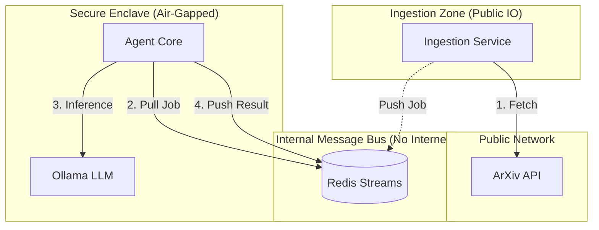

# The AI Safety Radar

**Autonomous Cyber Threat Intelligence Engine for AI Safety**

The AI Safety Radar is an agentic intelligence engine that autonomously monitors, analyzes, and categorizes emerging threats in the AI Safety and Security domain.

### Project Status
<!-- AUTO_UPDATE:STATS:START -->
- **Papers Analyzed**: 0
- **Pending Queue**: 0
<!-- AUTO_UPDATE:STATS:END -->

### 🕵️ Recent High-Severity Threats
<!-- AUTO_UPDATE:RECENT_THREATS:START -->
_No data yet._
<!-- AUTO_UPDATE:RECENT_THREATS:END -->

## Features
- **Autonomous Ingestion**: Monitors ArXiv, GitHub, and other sources.
- **Agentic Analysis**: Uses LLMs (`LiteLLM` + `Instructor`) to extract structured threat signatures.
- **Dual-Mode Operation**:
  - **Cloud**: Uses OpenAI GPT-4o for high precision.
  - **Local (Jetson)**: Uses Ollama (Llama 3 / Mistral) for privacy and edge deployment.
- **Morden Stack**: Built with `langgraph`, `pydantic v2`, and `uv`.

## 🚀 Getting Started

### Prerequisites
- Python 3.11+
- [uv](https://github.com/astral-sh/uv) (Package Manager)
- Docker & Docker Compose (optional for full deployment)

### Installation

1. **Clone the repository**
   ```bash
   git clone https://github.com/your-username/ai-safety-radar.git
   cd ai-safety-radar
   ```

2. **Install dependencies**
   ```bash
   uv sync
   ```

3. **Configure Environment**
   ```bash
   cp .env.example .env
   # Edit .env with your API keys
   ```

### Usage

**Run the pipeline locally:**
```bash
uv run python -m ai_safety_radar.scripts.run_pipeline
```
*(Note: Implementation pending for the full pipeline entrypoint)*

**Run tests:**
```bash
uv run pytest
```

**Type checking:**
```bash
uv run mypy src/ --strict
```

### Initial Setup (One-Time)
Because the `ollama` service is isolated on an internal network, it cannot download models at runtime. You must pre-populate the model volume:

```bash
chmod +x scripts/setup_ollama.sh
./scripts/setup_ollama.sh
```

### Running the Stack
```bash
docker-compose up --build
```
Access the **Intelligence Dashboard** at `http://localhost:8501`.

## 🐳 Docker Deployment

To run the full stack including a local Ollama instance:

```bash
docker-compose up --build
```

## 🛡️ Security Architecture

**SL4 Principles Applied**: Network Isolation, Least Privilege, Defense-in-Depth.

### The Data Diode Pattern
The system uses a decoupled architecture to ensure the **Agent Core** (which executes potentially dangerous prompts) is completely air-gapped from the Internet.



- **Forensic Logging**: All prompts are hashed (SHA256) and logged to `audit.jsonl` for post-event analysis.
- **Hardening**: Containers run as non-root user (`1000:1000`) with all capabilities dropped (`cap_drop: ["ALL"]`).

## Architecture

- **Ingestion**: Async `httpx` scrapers.
- **Orchestration**: `LangGraph` state machine.
- **Data**: `Pydantic` models -> `Parquet` on Hugging Face.

## License

MIT
