# AI Safety Radar

An autonomous threat intelligence engine that monitors, filters, and analyzes AI security research from ArXiv.

## Key Features

- **Two-Stage Filtering** — Regex pre-filter + LLM validation (60% fewer API calls)
- **Multi-Agent Pipeline** — Filter → Extract → Critic → Curator workflow
- **OpenAI Integration** — gpt-5-nano (filter) + gpt-5-mini (analysis) via Podman secrets
- **Real-time Dashboard** — Streamlit UI at `localhost:8501`
- **Security-First** — Air-gapped agent core, least-privilege containers
- **Backfill Tool** — One-command historical data population

## Architecture


### Agent Pipeline

```mermaid
flowchart TB
    subgraph Ingestion Service
        Fetch[Fetch ArXiv] --> PreFilter[Regex Pre-Filter]
        PreFilter -->|score < 25| Reject1[❌ Auto-Reject]
        PreFilter -->|score 25-65| LLM[FilterAgent<br/>gpt-5-nano]
        PreFilter -->|score > 65| Accept1[✅ Auto-Accept]
        LLM -->|relevant| Accept2[✅ Accept]
        LLM -->|not relevant| Reject2[❌ Reject]
    end

    subgraph Agent Core
        Accept1 & Accept2 --> Queue[papers:pending]
        Queue --> Extract[ExtractionAgent<br/>gpt-5-mini]
        Extract --> Critic[CriticAgent]
        Critic --> Store[papers:analyzed]
        Store --> Curator[CuratorAgent<br/>Weekly Digest]
    end

    Store --> Dashboard[Streamlit Dashboard]
```



## Quickstart

### Prerequisites

- Ubuntu 24.04 (or compatible Linux)
- Podman + Podman Compose
- OpenAI API key

### 1. Clone and Configure

```bash
git clone https://github.com/your-username/ai-safety-radar.git
cd ai-safety-radar
```

### 2. Create OpenAI Secret

```bash
# Create Podman secret (one-time setup)
echo "sk-your-openai-key-here" | podman secret create openai_api_key -
```

### 3. Start Services

```bash
podman-compose up -d
```

### 4. Verify

```bash
# Check all containers running
podman ps --filter name=ai-safety-radar

# Check logs for successful startup
podman logs ai-safety-radar_ingestion_service_1 | grep EFFECTIVE_CONFIG
# Expected: EFFECTIVE_CONFIG effective_filter_model=gpt-5-nano effective_analysis_model=gpt-5-mini provider=openai
```

### 5. Access Dashboard

Open http://localhost:8501

## Configuration

Configuration lives in `config.yaml` with environment variable overrides.

```yaml
llm:
  filter_model: "gpt-5-nano"      # Fast/cheap for filtering
  analysis_model: "gpt-5-mini"    # Quality for extraction/critic/curator

filter:
  mode: "balanced"                # permissive | balanced | strict
  regex_threshold: 25             # Below = auto-reject
  auto_accept_threshold: 65       # Above = auto-accept

ingestion:
  max_results: 30                 # Papers per fetch
  days_back: 14                   # Look-back window
```

**Priority:** Environment vars > `config.yaml` > code defaults

```bash
# Override example
ARXIV_MAX_RESULTS=100 podman-compose restart ingestion_service
```

## Secrets Management

OpenAI API key is loaded via Podman secrets (not environment variables):

```bash
# Create secret
echo "sk-..." | podman secret create openai_api_key -

# Verify secret exists
podman secret ls

# Secret is mounted at /run/secrets/openai_api_key inside containers
```

**Security:** Secrets are never logged, never in env vars, never in docker-compose.yml.

## Backfill (Historical Data)

Populate the dashboard with 1-2 months of papers:

```bash
# Run backfill (60 days, 200 papers max)
podman exec -it ai-safety-radar_ingestion_service_1 \
  python -m ai_safety_radar.scripts.backfill_once \
  --days-back 60 --max-results 200

# Expected output:
# 📊 BACKFILL SUMMARY
# ============================================================
#   Fetched:         200 papers
#   Accepted:        ~77 papers (38%)
#   Duration:        ~15 minutes
```

**Cost estimate:** ~$0.05 for 200 papers with gpt-5-nano/mini

## Troubleshooting

### NOGROUP Error

```
NOGROUP No such key 'papers:pending' or consumer group 'agent_group'
```

**Fix:** Recreate consumer group:
```bash
podman exec ai-safety-radar_redis_1 redis-cli \
  XGROUP CREATE papers:pending agent_group 0 MKSTREAM
```

### Queue Stuck (pending > 0, analyzed = 0)

**Check queue state:**
```bash
podman exec ai-safety-radar_redis_1 redis-cli XLEN papers:pending
podman exec ai-safety-radar_redis_1 redis-cli XLEN papers:analyzed
```

**Check agent_core logs:**
```bash
podman logs --tail 50 ai-safety-radar_agent_core_1
```

**Common causes:**
1. Consumer group missing → recreate (see above)
2. All papers marked as duplicates → clear processed markers:
   ```bash
   podman exec ai-safety-radar_redis_1 redis-cli --scan --pattern "processed:*" | \
     xargs -r podman exec -i ai-safety-radar_redis_1 redis-cli DEL
   ```
3. LLM errors → check for temperature/API errors in logs

### 0 Papers Analyzed

**Check filter is accepting papers:**
```bash
podman logs ai-safety-radar_ingestion_service_1 | grep -E "ACCEPTED|REJECTED"
```

**If acceptance rate too low:** Adjust thresholds in `config.yaml`:
```yaml
filter:
  regex_threshold: 20      # Lower = accept more
  auto_accept_threshold: 60
```

### Temperature Error (gpt-5 models)

```
Unsupported value: 'temperature' does not support 0.0
```

**Fix:** This is handled automatically. If you see this, restart containers:
```bash
podman-compose restart agent_core ingestion_service
```

### Safe Reset (Without Breaking Consumer Groups)

**Never use `FLUSHDB`!** Instead:
```bash
# Delete streams
podman exec ai-safety-radar_redis_1 redis-cli DEL papers:pending papers:analyzed

# Clear processed markers
podman exec ai-safety-radar_redis_1 redis-cli --scan --pattern "processed:*" | \
  xargs -r podman exec -i ai-safety-radar_redis_1 redis-cli DEL

# Recreate consumer group
podman exec ai-safety-radar_redis_1 redis-cli \
  XGROUP CREATE papers:pending agent_group 0 MKSTREAM
```

### Container Won't Start

**Check secret exists:**
```bash
podman secret ls | grep openai_api_key
```

**Check logs:**
```bash
podman logs ai-safety-radar_ingestion_service_1
```

### Dashboard Shows No Data

1. Check Redis has data: `redis-cli XLEN papers:analyzed`
2. Check dashboard can reach Redis: `podman logs ai-safety-radar_dashboard_1`
3. Restart dashboard: `podman-compose restart dashboard`

## Development

### Run Tests

```bash
uv run pytest tests/ -v
```

### Restart vs Rebuild

| Change Type | Command |
|-------------|---------|
| Python code (`src/`) | `podman-compose restart <service>` |
| `config.yaml` | `podman-compose restart <service>` |
| `pyproject.toml` / `uv.lock` | `podman-compose build <service>` |
| `Dockerfile` | `podman-compose build <service>` |

Source code is bind-mounted (`./src:/app/src:ro`), so Python changes are live after restart.

### Useful Commands

```bash
# View effective model config
podman logs ai-safety-radar_ingestion_service_1 | grep EFFECTIVE_CONFIG

# Monitor LLM calls in real-time
podman logs -f ai-safety-radar_agent_core_1 | grep LLM_RESPONSE

# Check Redis streams
podman exec ai-safety-radar_redis_1 redis-cli XLEN papers:pending
podman exec ai-safety-radar_redis_1 redis-cli XLEN papers:analyzed

# Trigger manual ingestion
podman exec ai-safety-radar_redis_1 redis-cli PUBLISH agent:trigger ingest
```

## Documentation

- [Portfolio & Research Findings](docs/MATS_PORTFOLIO.md)
- [Threat Model](docs/THREAT_MODEL.md)
- [Operator's Guide](docs/PROJECT_STATE.md)
- [Development Guide](docs/DEV.md)

## License

MIT
