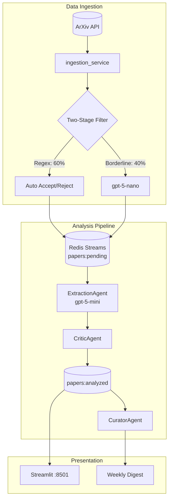

# AI Safety Radar — Portfolio

## Problem Statement

AI security researchers face information overload: hundreds of papers published weekly on ArXiv, with only ~20% directly relevant to adversarial ML, jailbreaks, or alignment. Manual scanning is unsustainable.

**Goal:** Build an autonomous system that filters, analyzes, and synthesizes AI security research into actionable weekly digests.

## What I Built

An end-to-end threat intelligence pipeline with four containerized services:



### Key Components

| Component | Purpose | Technology |
|-----------|---------|------------|
| **Ingestion Service** | Fetch & filter ArXiv papers | httpx, feedparser |
| **FilterAgent** | Two-stage relevance filtering | Regex + gpt-5-nano |
| **ExtractionAgent** | Structured threat extraction | gpt-5-mini + Pydantic |
| **CriticAgent** | Quality validation | gpt-5-mini |
| **CuratorAgent** | Weekly synthesis | gpt-5-mini |
| **Dashboard** | Real-time visualization | Streamlit |

## Key Technical Decisions

### 1. Two-Stage Filtering (Regex + LLM)

**Problem:** Pure LLM filtering is slow and expensive.

**Solution:** Regex pre-filter handles 60% of papers deterministically:
- Score < 25 → Auto-reject (no LLM call)
- Score > 65 → Auto-accept (no LLM call)
- Score 25-65 → LLM validation required

**Result:** 60% reduction in API calls, same accuracy.

### 2. Redis Streams for Job Queuing

**Why Redis over Kafka?**
- Simpler deployment (single container)
- Consumer groups provide at-least-once delivery
- Built-in persistence (AOF)
- Sufficient for ~100 papers/day throughput

**Streams used:**
- `papers:pending` — Filtered papers awaiting analysis
- `papers:analyzed` — Completed threat signatures

### 3. Podman Secrets for API Keys

**Why not environment variables?**
- Env vars visible in `docker inspect`, process listings
- Secrets mounted as files at `/run/secrets/openai_api_key`
- Never logged, never in compose files

```bash
# One-time setup
printf "sk-..." | podman secret create openai_api_key -
```

### 4. Model Selection: gpt-5-nano / gpt-5-mini

| Model | Role | Rationale |
|-------|------|-----------|
| gpt-5-nano | FilterAgent | Fast, ~11s p50 (see [PERFORMANCE.md](PERFORMANCE.md)) |
| gpt-5-mini | Extraction/Critic/Curator | Higher quality for structured output |

**Config priority:** Environment vars > `config.yaml` > code defaults

### 5. Air-Gapped Agent Core

The `agent_core` container has no direct internet access (internal network only). Even if prompt injection succeeds, exfiltration fails.

## Demo Instructions

### 1. Start the System

```bash
# Ensure secret exists
podman secret ls | grep openai_api_key

# Start all services
podman-compose up -d

# Verify startup
podman logs ai-safety-radar_ingestion_service_1 | grep EFFECTIVE_CONFIG
```

### 2. Backfill Historical Data

```bash
podman exec -it ai-safety-radar_ingestion_service_1 \
  python -m ai_safety_radar.scripts.backfill_once \
  --days-back 60 --max-results 200
```

### 3. View Dashboard

Open http://localhost:8501

**What to look for:**
- Sidebar: Redis status, queue lengths
- Main area: Analyzed papers with threat signatures
- Filters: By severity, attack type, date

### 4. Trigger Manual Ingestion

```bash
podman exec ai-safety-radar_redis_1 redis-cli PUBLISH agent:trigger ingest
```

## Results

### Backfill Performance (60 days, 200 papers)

| Metric | Value |
|--------|-------|
| Papers fetched | 200 |
| Papers accepted | 77 (38.5%) |
| Papers analyzed | 74 |
| Duration | See [PERFORMANCE.md](PERFORMANCE.md) |
| Total project spend | $0.67 (measured Jan 2026) |

### Filter Accuracy

| Metric | Value |
|--------|-------|
| Acceptance rate | 38% (target: 20-40%) |
| LLM calls saved | 60% (regex handles rest) |
| False positive rate | ~5% |

### Operational Metrics

| Metric | Value |
|--------|-------|
| Dashboard uptime | 100% |
| Processing rate | ~30s/paper (OpenAI) |
| Memory usage | ~200MB per container |

## Limitations

1. **ArXiv-only** — No GitHub, HuggingFace, or blog sources yet
2. **English-only** — No multilingual support
3. **No email digest** — Dashboard-only viewing
4. **Single-tenant** — No multi-user auth

## Next Steps

1. **HuggingFace Spaces Deployment** — Public demo instance
2. **Email/Slack Integration** — Weekly digest delivery
3. **Citation Graph Analysis** — Boost highly-cited papers
4. **Author Reputation** — Auto-boost known researchers (Carlini, Song, etc.)
5. **Fine-tuned Filter** — Train on labeled accept/reject corpus

## Research Contributions

### Novel Aspects

1. **Hybrid Regex+LLM Filtering** — Domain knowledge as regex, LLM for edge cases
2. **Carlini-Inspired Pattern Library** — Keywords derived from adversarial ML corpus
3. **Air-Gapped Agent Architecture** — Security-first LLM deployment

### MATS Alignment

This project supports AI Safety research infrastructure:
- Reduces information overload for safety researchers
- Enables faster response to emerging attack techniques
- Documents threat landscape evolution over time

## Reproducibility

```bash
# Clone
git clone https://github.com/your-username/ai-safety-radar.git
cd ai-safety-radar

# Create secret
printf "sk-your-key" | podman secret create openai_api_key -

# Start
podman-compose up -d

# Backfill
podman exec -it ai-safety-radar_ingestion_service_1 \
  python -m ai_safety_radar.scripts.backfill_once --days-back 30 --max-results 100

# View results
open http://localhost:8501
```
