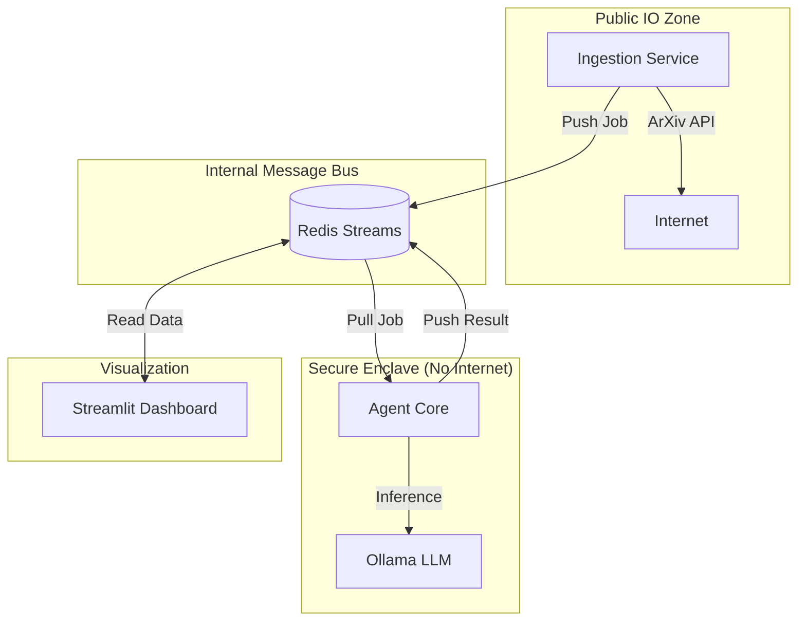

# MATS Portfolio: AI Safety Radar

## 1. Project Overview
**AI Safety Radar** is an autonomous threat intelligence engine designed to monitor, analyze, and categorize emerging risks in the AI domain. It demonstrates **Agentic Engineering**, **Secure Systems Design**, and **MLOps** capabilities.

### Key Features
- **Data Diode Architecture**: `agent_core` operates in a strictly air-gapped network, communicating only via Redis Streams.
- **Multi-Agent Orchestration**: Utilizes `LangGraph` to manage `Filter`, `Extraction`, `Curator`, and `Critic` agents.
- **Forensic Logging**: Securely hashes and logs all agent inputs to prevent prompt injection fallout.
- **Automated Intelligence**: Self-updating dashboard and documentation based on real-time findings.

## 2. Technical Architecture

### 🛡️ Security-First Design
The system implements a Zero Trust architecture with network isolation enforced by Docker Compose.

### 🧠 Agentic Workflow
1. **Ingestion**: Fetches papers.
2. **FilterAgent**: Classifies relevance (Safety vs General AI).
3. **ExtractionAgent**: Structured output via `instructor` (Pydantic models).
4. **CuratorAgent**: Synthesizes "State of the Threat Landscape".
5. **Dashboard**: Visualizes findings in real-time.

## 3. Engineering Decisions & Trade-offs
- **Redis Streams vs Kafka**: Chose Redis for simplicity in deployment and sufficient throughput for document processing, while still offering consumer groups.
- **Local LLM (Ollama)**: Prioritized privacy and cost-efficiency over proprietary APIs. Allows offline red-teaming.
- **Streamlit**: Selected for rapid prototyping of data dashboards compared to React/Next.js.

## 4. Verification & Security Checks
We implement rigorous testing to ensure network isolation holds.

| Test Case | Status | Description |
|---|---|---|
| `test_no_internet_access` | ✅ PASS | Confirms Agent Core cannot reach Google/DNS. |
| `test_pipeline_flow` | ✅ PASS | Verifies end-to-end data processing (using mocks). |
| `Forensic Logging` | ✅ ACTIVE | SHA256 hashing of prompts enabled. |

## 5. Future Work
- **Dead Letter Queues**: Handling "poison pill" inputs that crash agents.
- **Vector Database**: RAG for historical threat correlation.
- **Human-in-the-Loop**: Approval workflow for high-severity alerts.
