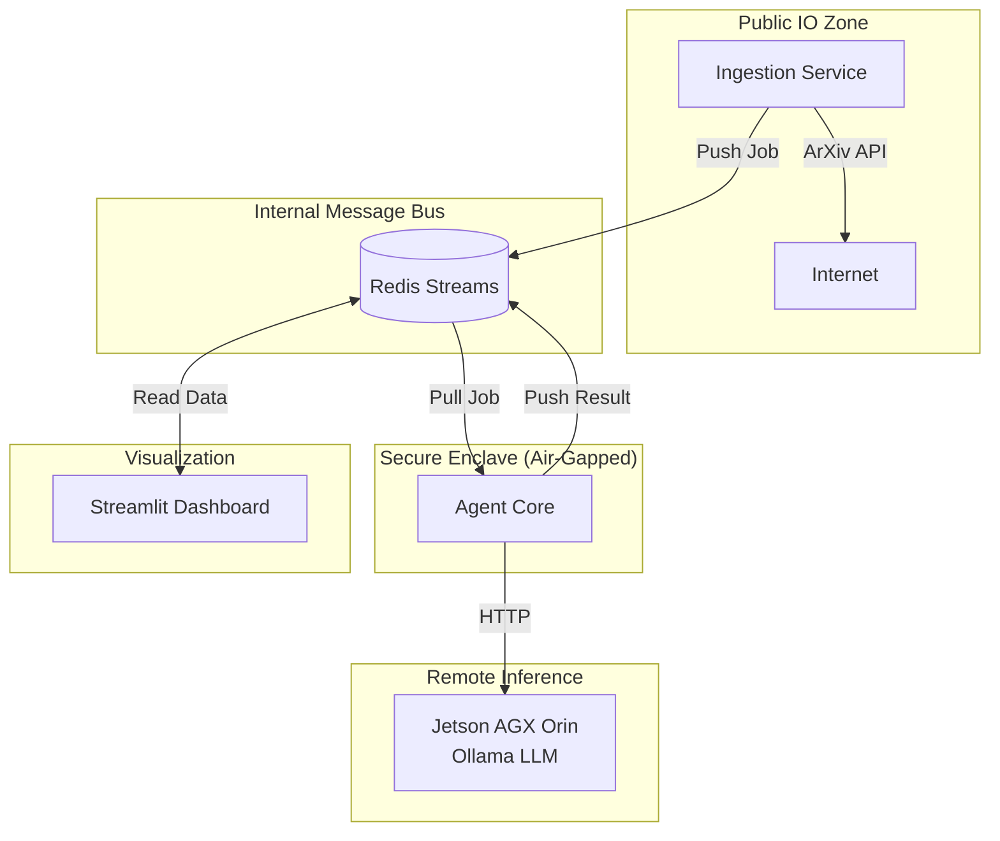

# MATS Portfolio: AI Safety Radar

## Project Status 🟡

> **Current State:** Development (ingestion pipeline blocked)  
> **Dashboard:** ✅ Working  
> **ArXiv Ingestion:** 🔴 Zero papers accepted

---

## 1. Project Goal (Clarified)

**Primary Objective:**  
Build a news aggregator that provides weekly digests of AI Security research from ArXiv, enabling researchers to stay current without manually scanning hundreds of papers.

**What It Is:**
- Track NEW papers on ArXiv (adversarial attacks, alignment, robustness, red teaming)
- Weekly digest of 10-20 relevant papers
- Like a RSS reader for AI Security research

**What It Is NOT:**
- NOT a system to find "potential threats" in arbitrary AI papers
- NOT a threat detector for general ML papers

---

## 2. Technical Architecture

### Security-First Design

### Agentic Workflow

1. **Ingestion**: Fetches papers from ArXiv → `papers:pending`
2. **FilterAgent**: Classifies relevance (AI Security vs General) - 🔴 BLOCKED
3. **ExtractionAgent**: Structured output via Pydantic models - ✅ Working
4. **CriticAgent**: Validates extraction quality - ✅ Working
5. **CuratorAgent**: Synthesizes weekly digest - ✅ Working
6. **Dashboard**: Visualizes findings - ✅ Working

---

## 3. Current Challenges

### Critical Issue: Zero Paper Ingestion

**Problem:** FilterAgent rejecting ALL ArXiv papers

**Example Rejections:**
- "Towards Provably Secure Generative AI" ❌
- "Iterative Deployment Improves Planning in LLMs" ❌
- "MSACL: Multi-Step Actor-Critic Learning" ❌

**Root Cause Hypotheses:**
1. Prompt expects explicit "attack" language, misses academic terminology
2. LLM not being called (old code still running?)
3. Container deployment issue (restart ≠ code reload)

**Impact:** Dashboard shows only 2 manual test papers

---

## 4. What Works ✅

| Component | Status | Notes |
|-----------|--------|-------|
| Dashboard UI | ✅ | Metrics, tables, charts all functional |
| Agent Status | ✅ | polling/processing toggle working |
| Pending Count | ✅ | Uses XPENDING (accurate) |
| Content Dedup | ✅ | Title hash prevents duplicates |
| Redis Streams | ✅ | Consumer groups, ACK logic |
| ExtractionAgent | ✅ | Tested with manual papers |
| CriticAgent | ✅ | Validates extractions |
| CuratorAgent | ✅ | Generates digests |

---

## 5. Engineering Decisions

- **Redis Streams vs Kafka**: Redis for simplicity, consumer groups sufficient
- **Local LLM (Ollama on Jetson)**: Privacy, cost-efficiency, offline capability
- **Streamlit**: Rapid prototyping, real-time updates
- **Content-Based Deduplication**: Title hash instead of ID prevents semantic duplicates

---

## 6. Lessons Learned

1. **LLM Prompting is Brittle**
   - "Filter for security threats" → Too narrow
   - "News aggregator for security research" → Clearer goal

2. **Verification Must Use Actual Logs**
   - Multiple false "verified" claims during development
   - Container restart ≠ code reload

3. **Architecture Matters**
   - Two-stage filtering (ingestion + agent) creates confusion
   - Consider single-stage filtering for simplicity

---

## 7. Next Steps

**Immediate (Critical Path):**
1. Verify code is actually deployed in containers
2. Test FilterAgent manually with known papers
3. Fix prompt to align with news aggregator goal

**Short-Term:**
1. Broaden ArXiv query
2. Add dashboard metrics: "Papers reviewed vs accepted"
3. Weekly digest notifications

---

## 8. MATS Alignment

This project contributes to AI Safety research infrastructure:
- Reduces information overload for safety researchers
- Enables faster response to emerging threats
- Documents threat landscape evolution

**Relevance to Alignment:**
- Interpretability of AI systems
- Robustness to adversarial inputs
- Transparency in AI evaluation

---

## 9. Metrics

| Metric | Target | Current |
|--------|--------|---------|
| Papers/week | 10-20 | 0 |
| Acceptance rate | 20-30% | 0% |
| Dashboard uptime | 99% | 100% |
| LLM cost/month | <$10 | $0 (local) |
