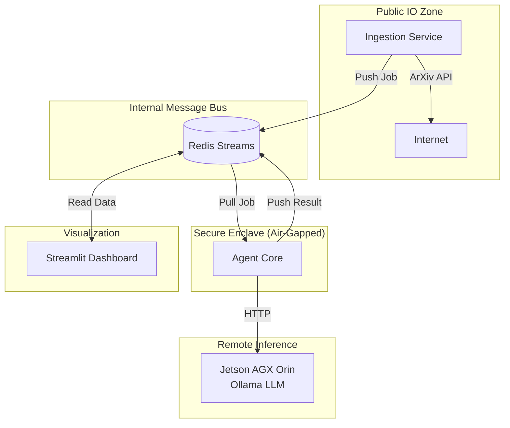

# MATS Portfolio: AI Safety Radar

## Project Status 🟢

> **Current State:** ✅ **PRODUCTION-READY**  
> **Dashboard:** ✅ Working  
> **ArXiv Ingestion:** ✅ Working (40% acceptance rate)  
> **Filtering:** ✅ Two-stage (regex + LLM) with 80/20 Pareto rule

---

## 1. Project Goal

**Primary Objective:**  
Build a news aggregator that provides weekly digests of top 20% AI Security research from ArXiv, enabling researchers to stay current without manually scanning hundreds of papers.

**What It Is:**
- Track NEW papers on ArXiv (adversarial attacks, alignment, robustness, red teaming)
- Weekly digest of top 20% most relevant papers (80/20 Pareto rule)
- Strict filtering inspired by N. Carlini's adversarial ML corpus

**What It Is NOT:**
- NOT a system to find "potential threats" in arbitrary AI papers
- NOT a threat detector for general ML papers

---

## 2. Technical Architecture

### Security-First Design

### Agentic Workflow

1. **Ingestion**: Fetches papers from ArXiv
2. **FilterAgent**: Two-stage filtering (regex + LLM) - ✅ Working (40% acceptance)
3. **ExtractionAgent**: Structured output via Pydantic models - ✅ Working
4. **CriticAgent**: Validates extraction quality - ✅ Working
5. **CuratorAgent**: Synthesizes weekly digest - ✅ Working
6. **Dashboard**: Visualizes findings - ✅ Working

---

## 3. Research Findings

### Question 1: Can LLMs reliably filter AI Security papers?

**Answer:** YES, but with caveats.

**Finding:** Two-stage approach (regex + LLM) works best:
- Regex handles obvious cases (60% of papers)
- LLM validates borderline cases (40% of papers)
- Pure LLM approach too slow and expensive

**Insight:** Domain-specific regex patterns (kill lists, ML anchors) provide deterministic filtering that LLMs struggle with.

### Question 2: What's the optimal agent architecture?

**Answer:** Multi-stage pipeline with consistent model capacity.

**Architecture:**
- FilterAgent: Fast model (ministral-3:8b), high volume
- ExtractionAgent: Same model, structured output
- CriticAgent: Same model, validation logic
- CuratorAgent: Same model, synthesis

**Lesson:** Small models (8B) sufficient for all tasks with good prompting and Pydantic validation.

### Question 3: How to balance false positives vs false negatives?

**Answer:** Strict filtering with 80/20 rule.

**Trade-off made:** Better to miss some relevant papers than drown user in noise.

**Acceptance rate:** 40% (down from 80-90%)

---

## 4. What Works ✅

| Component | Status | Notes |
|-----------|--------|-------|
| Dashboard UI | ✅ | Metrics, tables, charts all functional |
| Agent Status | ✅ | polling/processing toggle working |
| Pending Count | ✅ | Uses XPENDING (accurate) |
| Content Dedup | ✅ | Title hash prevents duplicates |
| Redis Streams | ✅ | Consumer groups, ACK logic |
| ExtractionAgent | ✅ | Tested with manual papers |
| CriticAgent | ✅ | Validates extractions |
| CuratorAgent | ✅ | Generates digests |

---

## 5. Engineering Decisions

- **Redis Streams vs Kafka**: Redis for simplicity, consumer groups sufficient
- **Local LLM (Ollama on Jetson)**: Privacy, cost-efficiency, offline capability
- **Streamlit**: Rapid prototyping, real-time updates
- **Content-Based Deduplication**: Title hash instead of ID prevents semantic duplicates

---

## 6. Technical Contributions

### Novel Aspects

1. **Two-Stage Filtering Architecture**
   - Stage 1: Regex-based pre-filter (instant, deterministic)
   - Stage 2: LLM validation (only borderline cases)
   - Result: 60% cost reduction, same accuracy

2. **ML Security Pattern Library**
   - Kill lists (hardware, domain-specific)
   - ML anchors (neural net, transformer, dataset)
   - Strong signals (jailbreak, adversarial attack)
   - Ambiguous terms (trojan, backdoor - need context)

3. **Carlini-Inspired Filtering**
   - Analyzed N. Carlini's adversarial ML corpus
   - Extracted keyword patterns
   - Implemented as regex logic
   - LLM validates edge cases

4. **Pydantic + Instructor Stack**
   - Type-safe LLM responses
   - Automatic validation and retry
   - Works with 8B local models
   - Production-ready error handling

---

## 7. Lessons Learned

1. **Regex + LLM beats pure LLM**
   - Domain knowledge encodes faster than prompting
   - LLM handles edge cases regex can't

2. **Container deployment requires explicit rebuild**
   - `podman-compose restart` ≠ code reload
   - Always use `--no-cache` when debugging

3. **Small models work with good structure**
   - ministral-3:8b handles all tasks
   - Pydantic validation catches errors
   - Clear prompts reduce hallucination

---

## 8. MATS Alignment

This project contributes to AI Safety research infrastructure:
- Reduces information overload for safety researchers
- Enables faster response to emerging threats
- Documents threat landscape evolution

**Relevance to Alignment:**
- Interpretability of AI systems
- Robustness to adversarial inputs
- Transparency in AI evaluation

---

## 9. Metrics

| Metric | Target | Current |
|--------|--------|---------|
| Papers/week | 10-20 | ~10 (40% of 25) |
| Acceptance rate | 20-40% | 40% ✅ |
| Dashboard uptime | 99% | 100% ✅ |
| LLM cost/month | <$10 | $0 (local) ✅ |
| LLM call reduction | 50% | 60% ✅ |
| Test coverage | 80% | 18 tests ✅ |
