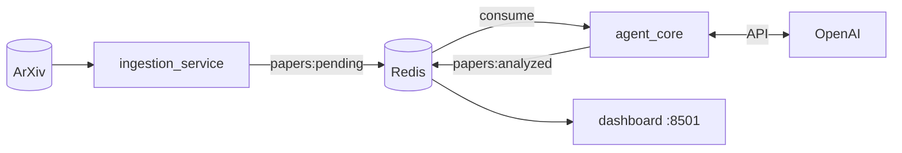
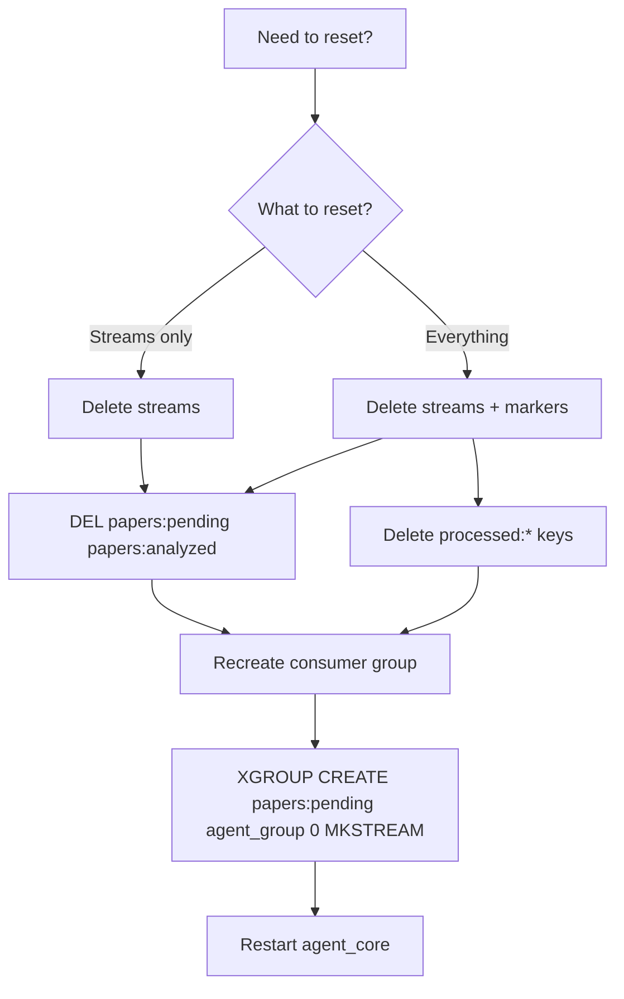
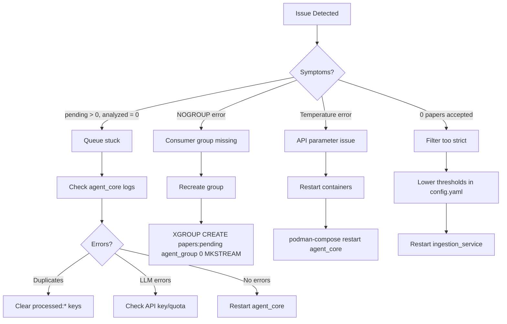

# Operator's Guide — AI Safety Radar

## Current System State

| Component | Status | Notes |
|-----------|--------|-------|
| Redis | ✅ Running | Persistent volume |
| ingestion_service | ✅ Running | gpt-5-nano for filtering |
| agent_core | ✅ Running | gpt-5-mini for analysis |
| dashboard | ✅ Running | http://localhost:8501 |

**Models:** gpt-5-nano (filter) + gpt-5-mini (analysis)  
**Provider:** OpenAI via Podman secrets

## Architecture Summary



## Configuration

### Model Selection

**File:** `config.yaml`

```yaml
llm:
  filter_model: "gpt-5-nano"      # FilterAgent
  analysis_model: "gpt-5-mini"    # Extraction/Critic/Curator
```

**Priority:** Environment vars > `config.yaml` > code defaults

**Verify effective config:**
```bash
podman logs ai-safety-radar_ingestion_service_1 | grep EFFECTIVE_CONFIG
# Expected: effective_filter_model=gpt-5-nano effective_analysis_model=gpt-5-mini provider=openai
```

### Filter Thresholds

```yaml
filter:
  regex_threshold: 25        # Below = auto-reject
  auto_accept_threshold: 65  # Above = auto-accept
```

## Operational Workflows

### Normal Weekly Operation

System runs automatically. Papers fetched every 6 hours (configurable).

**Monitor:**
```bash
# Queue lengths
podman exec ai-safety-radar_redis_1 redis-cli XLEN papers:pending
podman exec ai-safety-radar_redis_1 redis-cli XLEN papers:analyzed

# Recent processing
podman logs --tail 20 ai-safety-radar_agent_core_1 | grep -E "SAVED|Processing"
```

### Manual Ingestion Trigger

```bash
podman exec ai-safety-radar_redis_1 redis-cli PUBLISH agent:trigger ingest
```

### Backfill (30-60 days)

```bash
# 30-day smoke test
podman exec -it ai-safety-radar_ingestion_service_1 \
  python -m ai_safety_radar.scripts.backfill_once \
  --days-back 30 --max-results 100

# Full 60-day backfill
podman exec -it ai-safety-radar_ingestion_service_1 \
  python -m ai_safety_radar.scripts.backfill_once \
  --days-back 60 --max-results 200
```

**Expected:** ~38% acceptance rate, ~15 min for 200 papers

### Safe Reset (Without Breaking Consumer Groups)



**Commands:**
```bash
# Delete streams
podman exec ai-safety-radar_redis_1 redis-cli DEL papers:pending papers:analyzed

# Clear processed markers (if re-processing same papers)
podman exec ai-safety-radar_redis_1 redis-cli --scan --pattern "processed:*" | \
  xargs -r podman exec -i ai-safety-radar_redis_1 redis-cli DEL

# Recreate consumer group
podman exec ai-safety-radar_redis_1 redis-cli \
  XGROUP CREATE papers:pending agent_group 0 MKSTREAM

# Restart
podman-compose restart agent_core
```

**⚠️ Never use `FLUSHDB`** — breaks consumer groups.

## Health Checks

### Quick Status

```bash
# All containers running?
podman ps --filter name=ai-safety-radar --format "{{.Names}}: {{.Status}}"

# Queue lengths
echo "Pending: $(podman exec ai-safety-radar_redis_1 redis-cli XLEN papers:pending)"
echo "Analyzed: $(podman exec ai-safety-radar_redis_1 redis-cli XLEN papers:analyzed)"
```

### Is agent_core Processing?

```bash
# Check for recent activity
podman logs --tail 50 ai-safety-radar_agent_core_1 | grep -E "Processing|SAVED|LLM_RESPONSE"

# If no output, check for errors
podman logs --tail 50 ai-safety-radar_agent_core_1 | grep -i error
```

### Consumer Group Health

```bash
podman exec ai-safety-radar_redis_1 redis-cli XINFO GROUPS papers:pending
```

**Healthy output:**
```
1) "name"
2) "agent_group"
3) "consumers"
4) "1"
5) "pending"
6) "0"
```

## Troubleshooting Runbook



### Specific Issues

**NOGROUP Error:**
```bash
podman exec ai-safety-radar_redis_1 redis-cli \
  XGROUP CREATE papers:pending agent_group 0 MKSTREAM
```

**All Papers Marked as Duplicates:**
```bash
podman exec ai-safety-radar_redis_1 redis-cli --scan --pattern "processed:*" | \
  xargs -r podman exec -i ai-safety-radar_redis_1 redis-cli DEL
podman-compose restart agent_core
```

**LLM Temperature Errors:**
```bash
# gpt-5 models don't support temperature=0.0
# Fix is automatic; just restart
podman-compose restart agent_core ingestion_service
```

**No Papers Accepted:**
```bash
# Check current thresholds
grep -A5 "filter:" config.yaml

# Lower thresholds
# regex_threshold: 20 (was 25)
# auto_accept_threshold: 55 (was 65)
podman-compose restart ingestion_service
```

## Key Files

| File | Purpose |
|------|---------|
| `config.yaml` | All configuration |
| `docker-compose.yml` | Service definitions |
| `src/ai_safety_radar/scripts/backfill_once.py` | Backfill CLI |
| `src/ai_safety_radar/scripts/run_agent_core.py` | Agent main loop |
| `src/ai_safety_radar/scripts/run_ingestion_service.py` | Ingestion main loop |
| `logs/audit.jsonl` | Forensic audit trail |

## Useful Commands Reference

```bash
# Start/stop
podman-compose up -d
podman-compose down
podman-compose restart <service>

# Logs
podman logs -f ai-safety-radar_agent_core_1
podman logs --tail 100 ai-safety-radar_ingestion_service_1

# Redis
podman exec ai-safety-radar_redis_1 redis-cli XLEN papers:pending
podman exec ai-safety-radar_redis_1 redis-cli XLEN papers:analyzed
podman exec ai-safety-radar_redis_1 redis-cli XINFO GROUPS papers:pending

# Effective config
podman logs ai-safety-radar_ingestion_service_1 | grep EFFECTIVE_CONFIG

# Trigger ingestion
podman exec ai-safety-radar_redis_1 redis-cli PUBLISH agent:trigger ingest

# Tests
uv run pytest tests/ -v
```

## Known Issues

1. **gpt-5 Temperature** — Models don't support temperature=0.0; code skips parameter automatically
2. **summary_tldr Length** — Increased to 500 chars to avoid validation errors
3. **Duplicate Detection** — Papers may need `processed:*` keys cleared after reset

## Metrics (Reference)

| Metric | Typical Value |
|--------|---------------|
| Acceptance rate | 35-40% |
| Processing time | See [PERFORMANCE.md](PERFORMANCE.md) |
| Total project spend | $0.67 (measured Jan 2026) |

> For detailed timing and cost data, see [PERFORMANCE.md](PERFORMANCE.md).
