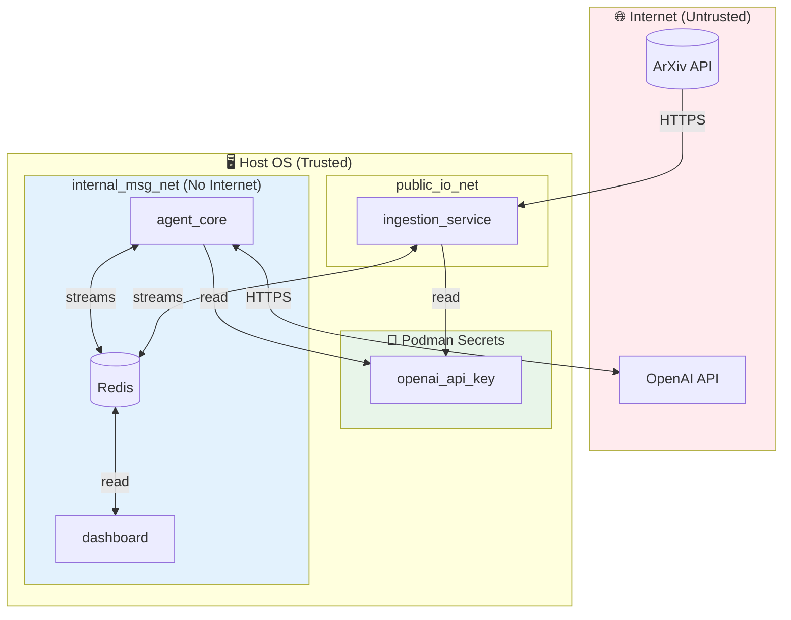
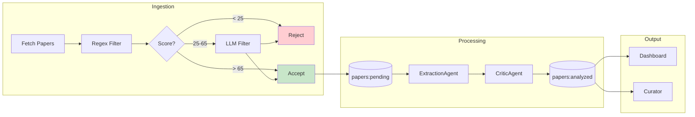

# Threat Model — AI Safety Radar

## Overview

This document defines the security boundaries, threats, and mitigations for the AI Safety Radar system.

## Trust Boundaries



## Assets

| Asset | Sensitivity | Location |
|-------|-------------|----------|
| OpenAI API Key | **Critical** | `/run/secrets/openai_api_key` |
| Analyzed Papers | Medium | Redis `papers:analyzed` |
| Audit Logs | Medium | `./logs/audit.jsonl` |
| User Trust | High | Dashboard integrity |

## Threats & Mitigations

### T1: API Key Exposure

**Threat:** OpenAI API key leaked via logs, env vars, or compose files.

**Impact:** Critical — Unauthorized API usage, billing fraud.

**Mitigations:**
- ✅ Key stored as Podman secret, mounted at `/run/secrets/`
- ✅ Never in environment variables or docker-compose.yml
- ✅ `secrets.py` reads file directly, never logs value
- ✅ `.gitignore` excludes secret files

**Residual Risk:** Low — Host compromise could access secret file.

### T2: Prompt Injection via ArXiv Paper

**Threat:** Malicious paper contains prompt injection payload designed to:
- Exfiltrate data
- Execute arbitrary code
- Manipulate analysis output

**Impact:** High — Data exfiltration or system compromise.

**Mitigations:**
- ✅ `agent_core` on internal network (no direct internet)
- ✅ Containers run as non-root (uid 1000)
- ✅ All capabilities dropped (`cap_drop: ALL`)
- ✅ `no-new-privileges` security option
- ✅ Pydantic validation rejects malformed outputs
- ✅ Input hashed and logged for forensic analysis

**Residual Risk:** Medium — Sophisticated injection could still manipulate outputs.

### T3: Supply Chain Compromise

**Threat:** Malicious dependency introduced via PyPI or container image.

**Impact:** Critical — Full system compromise.

**Mitigations:**
- ✅ `uv.lock` pins exact dependency versions
- ✅ Base image pinned (`python:3.11-slim-bookworm`)
- ✅ Network isolation limits C2 communication
- ✅ Containers have minimal filesystem access

**Residual Risk:** Medium — Zero-day in pinned dependency.

### T4: Redis Data Loss / Consumer Group Corruption

**Threat:** `FLUSHDB` or stream deletion breaks consumer groups.

**Impact:** Medium — Papers lost, processing halts.

**Mitigations:**
- ✅ Documentation explicitly warns against `FLUSHDB`
- ✅ Safe reset procedure documented:
  ```bash
  redis-cli DEL papers:pending papers:analyzed
  redis-cli XGROUP CREATE papers:pending agent_group 0 MKSTREAM
  ```
- ✅ Redis AOF persistence enabled
- ✅ Volume mount preserves data across restarts

**Residual Risk:** Low — Operator error still possible.

### T5: Log Leakage

**Threat:** Sensitive content (paper abstracts, prompts) leaked via logs.

**Impact:** Low — Privacy concern, not security breach.

**Mitigations:**
- ✅ Prompts hashed (SHA256) before logging
- ✅ API keys never logged
- ✅ Structured JSON logging (no string interpolation accidents)
- ✅ Log files excluded from git

**Residual Risk:** Low — Abstracts are public anyway.

### T6: Dashboard Unauthorized Access

**Threat:** Unauthorized users access dashboard and view analyzed papers.

**Impact:** Low — Data is derived from public ArXiv papers.

**Mitigations:**
- ⚠️ Dashboard currently has no authentication
- ✅ Bind to localhost only by default
- ✅ Internal network isolation

**Residual Risk:** Medium — Should add auth for production deployment.

### T7: Denial of Service

**Threat:** Attacker floods system with papers or malformed requests.

**Impact:** Medium — Service unavailability.

**Mitigations:**
- ✅ Rate limiting via `interval_seconds` config
- ✅ `max_results` caps papers per cycle
- ✅ Redis memory limits possible via config
- ⚠️ No explicit rate limiting on API calls

**Residual Risk:** Medium — OpenAI rate limits provide some protection.

## Data Flow Diagram



## Security Controls Summary

| Control | Status | Notes |
|---------|--------|-------|
| Secrets via Podman | ✅ | Not env vars |
| Non-root containers | ✅ | uid 1000 |
| Capability drop | ✅ | cap_drop: ALL |
| Network isolation | ✅ | Internal networks |
| Input validation | ✅ | Pydantic models |
| Audit logging | ✅ | Hashed prompts |
| Dependency pinning | ✅ | uv.lock |
| Authentication | ⚠️ | Not implemented |
| Rate limiting | ⚠️ | Config-based only |

## Monitoring Recommendations

1. **API Usage** — Monitor OpenAI billing dashboard
2. **Queue Growth** — Alert if `papers:pending` > 1000
3. **Error Rate** — Monitor `LLM_RESPONSE status=error` in logs
4. **Container Health** — Podman healthchecks

## Incident Response

### API Key Compromise

1. Revoke key immediately in OpenAI dashboard
2. Create new key: `echo "sk-new" | podman secret rm openai_api_key && podman secret create openai_api_key -`
3. Restart containers: `podman-compose down && podman-compose up -d`
4. Review audit logs for unauthorized usage

### Data Corruption

1. Stop processing: `podman-compose stop agent_core`
2. Backup Redis: `podman exec redis redis-cli BGSAVE`
3. Investigate logs
4. Safe reset if needed (see T4 mitigation)
5. Re-run backfill

## References

- [OWASP LLM Top 10](https://owasp.org/www-project-top-10-for-large-language-model-applications/)
- [Docker Security Best Practices](https://docs.docker.com/develop/security-best-practices/)
- [Redis Security](https://redis.io/docs/latest/operate/rs/security/)
